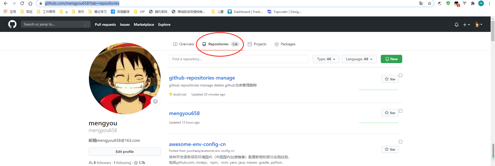
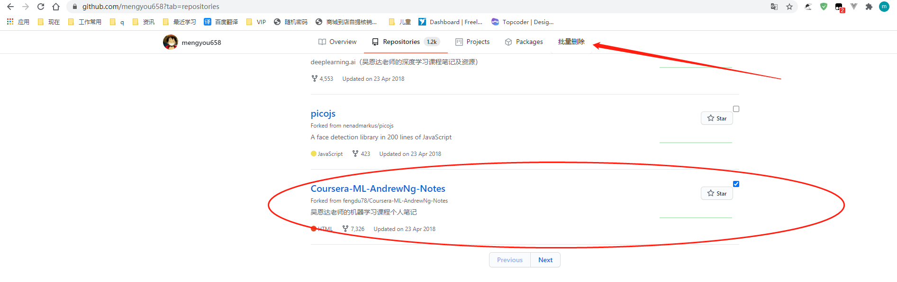
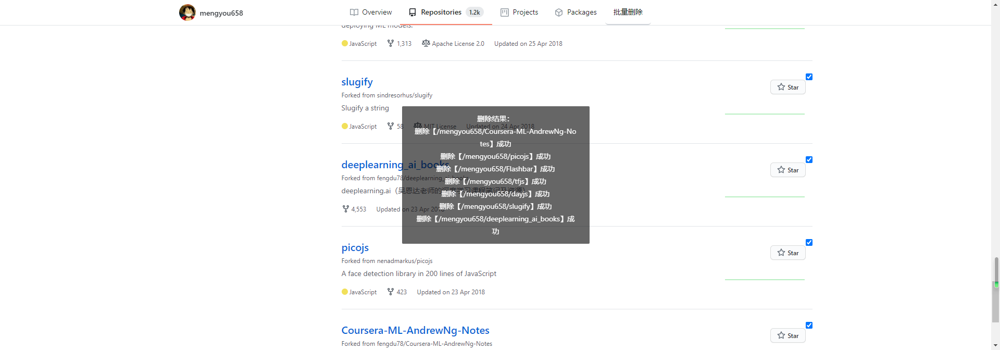

# github-repositories-manage
github repositories manage delete github仓库管理删除 油猴 脚本

**感觉不错，就给个star呗，送人玫瑰手有余香😘么么哒**

#### 安装地址
[https://greasyfork.org/zh-CN/scripts/412188-github%E9%A1%B9%E7%9B%AE%E6%89%B9%E9%87%8F%E5%88%A0%E9%99%A4](https://greasyfork.org/zh-CN/scripts/412188-github%E9%A1%B9%E7%9B%AE%E6%89%B9%E9%87%8F%E5%88%A0%E9%99%A4)

#### 使用方法
访问你自己的github仓库列表，例如：https://github.com/mengyou658?tab=repositories

选择需要删除的仓库，然后点击批量删除，等待提示信息

提示信息后会自动刷新界面

